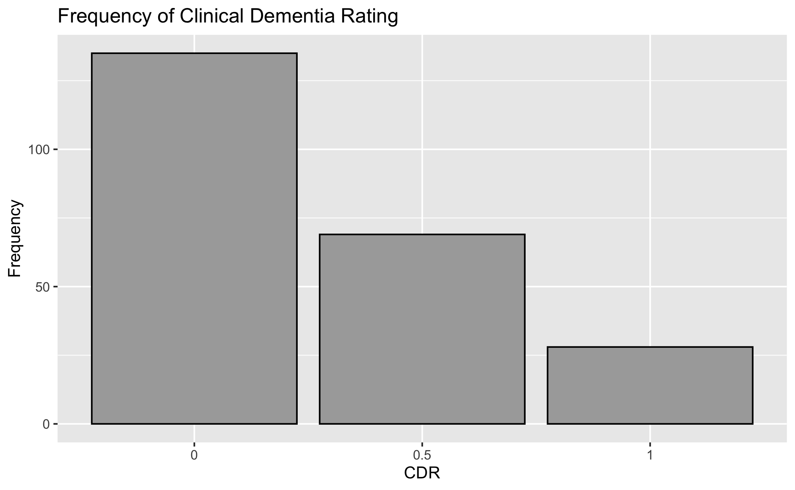
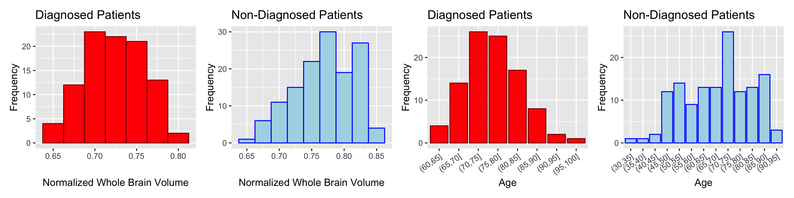
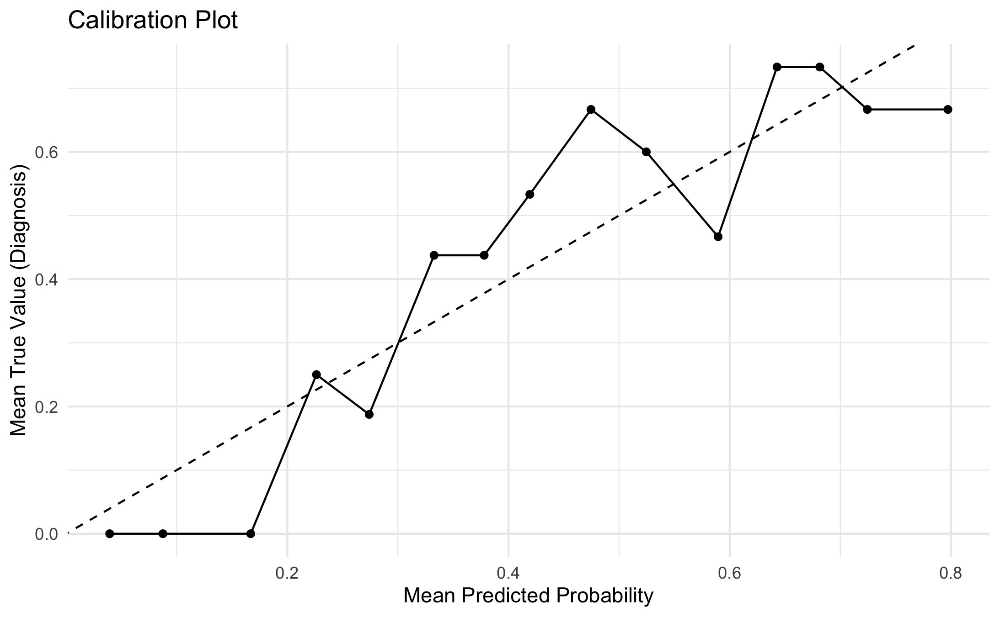
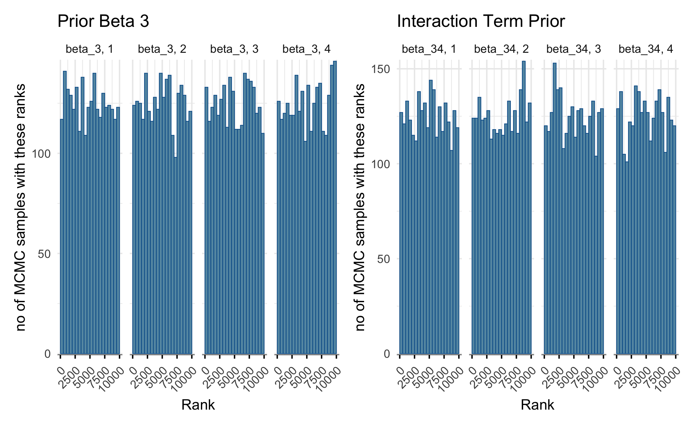
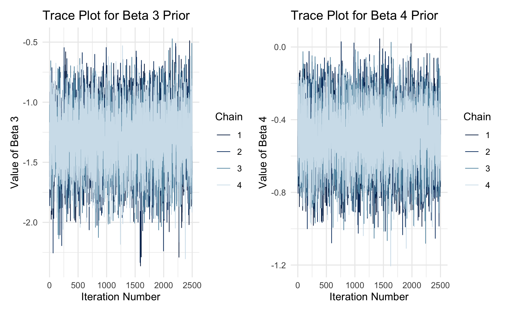
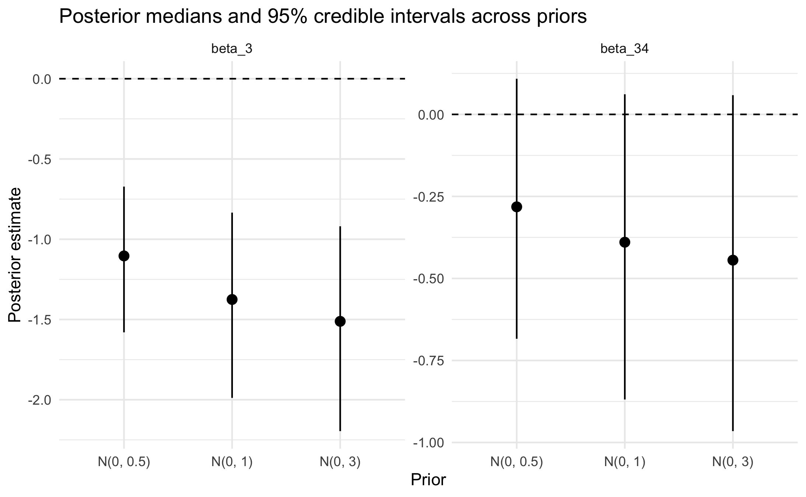
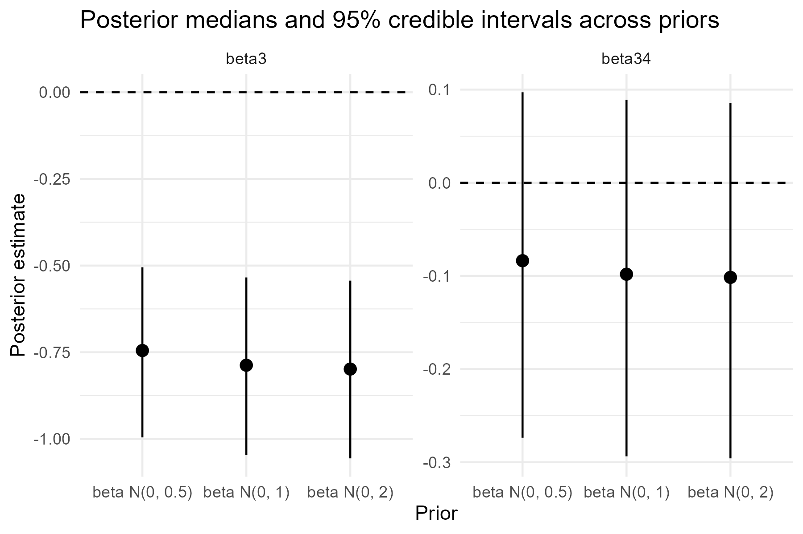

```{r setup, include=FALSE}
# imports 
knitr::opts_chunk$set(
  warning = FALSE,
  message = FALSE,
  echo = FALSE,
  fig.align = "center",
  fig.pos = "H",
  out.width = "85%"
)

library(knitr)
library(openxlsx)
library(dplyr)
library(ggplot2)
library(patchwork)
library(corrplot)
library(cmdstanr)
library(posterior)
library(bayesplot)
library(loo)
library(gridExtra)
library(png)
library(grid)
```

# Problem Formulation:
Alzheimer's disease is a progressive neurodegenerative disorder and the most common cause of dementia, characterized by declining memory and cognition. Early detection through biomarkers and MRI data is critical, as delayed treatment is associated with worse outcomes. In this project, we investigate clinical risk factors associated with Alzheimer's disease using Bayesian Statistics, aiming to identify which groups of people are at higher risk and support early intervention.

## Our research questions are:

i) **How are brain volume, age and biological sex associated with the probability of receiving a diagnosis of Alzheimer’s disease and the diagnosed CDR (Clinical dementia rating)**
- Is there an effect of sex on Alzheimer's disease probability?
- Do individuals with lower brain volume have higher CDR scores?
- Does higher education levels dampen the effect of brain volume on CDR?


## Basic Biological Context and Important Variables
**CDR (Clinical Dementia Rating)** is a common tool used to assess cognitive impairment, with scores mapped as follows: \newline
\small
0: none \quad 0.5: questionable \quad 1: mild \quad 2: moderate \quad 3: severe \newline
\normalsize
Any score \(> 0\) indicates probable AD, making CDR both a diagnostic and severity measure.

**MMSE: (Mini-Mental State Examination score)** A brief test of global cognitive function, with the following scores describing the severity of cognitive decline. \newline
\small
24--30: Normal \quad 19--23: Mild \quad 10--18: Moderate \quad 0--9: Severe

**eTIV (estimated total intracranial volume)** Estimated total volume inside skull, estimated from MRI results. 

**nWBV (normalized whole-brain volume)**  Proportion of the intracranial cavity occupied by brain tissue. A lower volume would indicate more brain atrophy. We are interested in this variable because brain atrophy is a key characteristic of Alzheimer’s disease progression. 

**Educ (Education Level)** describes an individual’s highest level of education: \newline
\small 
1: <HS \quad 2: HS grad \quad 3: some college \quad 4: bachelor’s \quad 5: postgraduate \newline
\normalsize

## Key Modelling Challenges:

The key modelling challenge is that the response variable, CDR, is an ordinal variable, with higher values indicating higher disease severity. We will begin with naive models treating CDR as a binary random variable. Then we would build upon this with a more sophisticated model to include the ordering. This is grounded in the framework of progressively increasing model complexity, as often done in the course. 

In addition, we will assess the posterior predictive probabilities for our model through cross-validation, a tool that we were introduced to in the course. We will apply concepts from the theme of Bayesian calibration in this section. 

# Literature Review

Alzheimer’s disease (AD) is a progressive neurodegenerative disorder characterized by cognitive decline and brain atrophy. Neuroimaging studies show that brain volume decreases with age and more rapidly in individuals with AD, reflecting disease-related neurodegeneration. These structural changes are closely associated with clinical measures such as the Clinical Dementia Rating (CDR) and Mini-Mental State Examination (MMSE).

A widely used dataset for studying these relationships is the Open Access Series of Imaging Studies (OASIS) (Marcus et al., 2007), which combines MRI-derived brain measures with demographic and clinical variables. Key variables include age, sex, education, and imaging measures such as estimated total intracranial volume (eTIV) and normalized whole brain volume (nWBV).

Among these, nWBV captures brain atrophy, while eTIV serves as a scaling measure for head size. Clinical variables such as CDR and MMSE quantify disease severity, and factors like socioeconomic status (SES) and education reflect social and cognitive influences on disease risk.

Previous studies using OASIS and related datasets have identified strong associations between brain atrophy and Alzheimer’s disease severity (Fotenos et al., 2005; Buckner et al., 2004). In addition, machine learning approaches such as support vector machines (Klöppel et al., 2008) and deep learning models (Suk et al., 2014) have achieved high predictive accuracy using imaging features. However, these methods often prioritize prediction over interpretability and provide limited uncertainty quantification.

Bayesian statistical methods offer a complementary framework by providing full posterior distributions of model parameters, enabling direct uncertainty quantification and incorporation of prior knowledge. This is particularly valuable in medical settings, where uncertainty is critical for decision-making.

Bayesian approaches have been applied to Alzheimer’s research to model disease progression and cognitive decline. For example, Fonteijn et al. (2012) proposed an event-based model describing disease progression as a sequence of latent events, while Donohue et al. (2014) used hierarchical models for longitudinal cognitive data. Despite these advantages, Bayesian methods remain relatively underutilized in analyses of the OASIS dataset, where most studies rely on frequentist or machine learning approaches.

## Summary

Existing literature establishes strong links between brain atrophy, demographic factors, and Alzheimer’s disease. However, it largely relies on predictive or frequentist approaches. By adopting a Bayesian perspective, this study contributes to the literature by providing interpretable, uncertainty-aware estimates of how brain structure and clinical variables jointly influence Alzheimer’s disease risk and severity.

## Exploratory Data Analysis
First, we must explore the dataset's feature distributions before designing and fitting models.

```{r, out.width = "45%"}

```
Most patients are not diagnosed with Alzheimers, and of the diagnosed patients, most of them have been diagnosed  with only mild dementia.

```{r}
diag_vs_sex <- read.csv("data/diag_vs_sex.csv")
kable(diag_vs_sex, caption = "Diagnosis vs Sex")
```
There are more females in the dataset, males have a higher diagnosis rate than females.

```{r, out.width = "110%"}

```
From the plot above, it appears diagnosed patients typically have less whole brain volume than non-diagnosed patients.  Diagnosed patients tend to be older, where non diagnosed patients represent all ages.

# Models

We build the following two models for our data. For the priors, standard deviations of the normal distributions have been kept small keeping in mind that covariates will be standardised. 
\subsection*{Naive Bayesian Logistic Regression Model}

\begin{align*}
\beta_j &\sim \mathcal{N}(0, 3), \quad \text{for } j \in \{0,1,2,3,4,43\}.
\end{align*}
\begin{align*}
\eta_i &= 
\beta_0 
+ \beta_1 \cdot \text{sex}_{i,\text{male}} 
+ \beta_2 \cdot \text{age}_i 
+ \beta_3 \cdot \text{brain\_vol}_i + \beta_4 \cdot \text{educ}_i \\ 
&\quad + \beta_{34} \cdot (\text{brain\_vol}_i \times \text{educ}_i).\\
\end{align*}
\begin{align*}
\text{CDR\_binary}_i \mid \eta_i \sim \text{Bernoulli}(logistic(\eta_i)).
\end{align*}

\subsection*{Complex Model}

Note that we have set $\beta_0 = 1$ for identifiability
\begin{align*}
\beta_j &\sim \mathcal{N}(0,2) \quad (j = 1, 2, 3 ,34) \\ 
\delta &\sim \text{Exp}\left(0.3\right) \\ 
k_0 &\sim \mathcal{N}(0,1), \quad k_1 = k_0 + \delta \\ 
\sigma &\sim \text{Exponential}(0.3)
\end{align*}

\paragraph{Hidden Disease Severity Score}
\begin{align*}
\mu(i) &= \beta_0 
+ \beta_1 \, \text{sex\_male}_i 
+ \beta_2 \, \text{age}_i 
+ \beta_3 \, \text{brain\_vol}_i 
+ \beta_4 \, \text{educ}_i \\ 
&\quad + \beta_{3,4} \, (\text{brain\_vol}_i \times \text{educ}_i)
\end{align*}
$$Z_i \mid \mu(i) \sim \mathcal{N}(\mu(i), \sigma)$$
\paragraph{Disease Outcome}
\[
Y_i \mid Z_i =
\begin{cases}
0 & \text{if } Z_i \le k_0 \\ 
0.5 & \text{if } k_0 \le Z_i \le k_1 \\ 
1 & \text{if } Z_i > k_1
\end{cases}
\]

# Implementation of the Naive Model

After fitting the model, we inspect the quality of the fit.
```{r}
fit_sum <- read.csv("results/naive_model/fit_summary.csv")
kable(head(fit_sum, n= 7))
```
`rhat` $\approx 1$ for all parameters, indicating that the chains have all converged to the same distribution.  The bulk and tail ESS are high, indicating efficient sampling.  

```{r, out.width = "50%"}

```
As we can see, the model is only decently calibrated.

```{r, out.width = "55%"}

```
All of the histograms look roughly flat for all 4 chains for the parameters displayed.  This is an indication of good mixing.

```{r, out.width = "60%"}

```
All 4 chains have plenty of overlap, and don't appear to be stuck at any point.  This demonstrates good mixing for all of the priors shown. 

```{r}
loo_output <- readRDS("results/naive_model/loo_output.rds")

print(loo_output$loo)

cat("Average probability assigned to true outcome:", round(loo_output$avg_prob, 3))
```
The Pareto k estimates tell us that there are no outliers influencing the model. \newline
The model is assigning 57.3% probability to the correct outcome (correct class of dementia diagnosis) on average for the leave-one-out predictions.  

## Sensitivity Analysis for Naive Model

```{r, out.width = "55%"}

```

# Implementation of the Complex Model
We now implement the complex model using STAN, once using its default algorithm and once using Variational Inference. 
After fitting using STAN's default algorithm (NUTS), we inspect the quality of the fit and calibration of the model.

```{r}
fit_sum <- read.csv("results/complex_model/fit_summary.csv")
kable(head(fit_sum))
```

```{r, fig.width=10, fig.height=3.8}
c0  <- rasterGrob(readPNG("plots/complex_model/calibration_class0.png"))
c05 <- rasterGrob(readPNG("plots/complex_model/calibration_class05.png"))
c1  <- rasterGrob(readPNG("plots/complex_model/calibration_class1.png"))

grid.arrange(c0, c05, c1, ncol = 3)
```

```{r, fig.width=10, fig.height=3.0}
b1r <- rasterGrob(readPNG("plots/complex_model/beta1_rank.png"))
b2r <- rasterGrob(readPNG("plots/complex_model/beta2_rank.png"))
k0r <- rasterGrob(readPNG("plots/complex_model/k0_rank.png"))

grid.arrange(b1r, b2r, k0r, ncol = 3)
```

```{r, fig.width=10, fig.height=3.0}
b1t  <- rasterGrob(readPNG("plots/complex_model/beta1_trace.png"))
b34t <- rasterGrob(readPNG("plots/complex_model/beta34_trace.png"))
k0t  <- rasterGrob(readPNG("plots/complex_model/k0_trace.png"))

grid.arrange(b1t, b34t, k0t, ncol = 3)
```

## Senstivity Analysis on the Complex Model
```{r, out.width = "45%"}

```

## HMC vs VI on the Complex Model
```{r, echo=FALSE, fig.width=8, fig.height=3.5}

b3d  <- rasterGrob(readPNG("plots/complex_model/beta3_density_hmc_vi.png"))
b34d <- rasterGrob(readPNG("plots/complex_model/beta34_density_hmc_vi.png"))

grid.arrange(b3d, b34d,ncol = 2)
```


## Results and Discussion

We will now try to tackle some of the questions we were interested in using the complex model. From our EDA, it seemed that males had a greater chance of being diagnosed. We try to find if the coefficient of sex_male in our model greater than 0 using the following two ways:

1. *Posterior Probability*: We estimated $P(\beta_1 >0 | Data) = 0.726$. Additionally $\mathbb{E}(\beta_1 | Data) = 0.395$ and a 90% credible interval is $[-0.777,	1.577]$.
We have some evidence that keeping the other variables constant, biological males usually have a higher CDR score than females.

2. *Decision Theory Framework*: We wish to make a decision whether $\beta_1 >0$. Let the action $a=1$ mean concluding that there is a positive slope $\beta_1$. Define the loss function:
$$L(a, \beta_1) = 2 \mathbb{I}(a = 1, \beta_1 <0) + \mathbb{I}(a = 0, \beta>0)$$ where $a=1$ indicates that we claim the slope is $>0$. This loss function was chosen because we would like to penalise a false positive much more than a false negative. Using this loss function we estimate

$L(a): = \mathbb{E}(L(a,X)) = 0.548\mathbb{I}(a=1) + 0.726\mathbb{I}(a = 0)$.

Hence, under this loss function, an optimal decision would be to conclude that the sex_male effect is positive.

Now, similarly to answer our second question we ask what is the probability of $\beta_3 + \beta_{34}educ_{i} < 0$? Using three different level of standardized education levels $(-1, 0, 1)$, we found that for each of the three levels, the posterior probability $Pr(\beta_3 + \beta_{34}*educ_{i} < 0|Data) \approx 1$. This table summarises the posterior means and credible intervals

| Education Level | Posterior Mean of Brain Volume Effect | 95% CrI | P(effect < 0) |
|---|---|---|---|
| Low (-1) | -2.845 | (-5.015, -1.229) | 1.00 |
| Mean (0) | -3.190 | (-5.355, -1.491) | 1.00 |
| High (-1) | -3.534 | (-6.13, -1.565) | 1.00 |


This gives strong evidence that that individuals with lower brain volume have higher CDR scores controlling for the other variables.  

To answer our final question, we need to ask whether the interaction term in our complex model $\beta_{34}$ is greater than 0. A positive term would mean that at higher education levels the effect of reducing brain volume on the severity of the disease is smaller.

1. *Posterior Probability*: We found $Pr(\beta_{34}> 0|Data) \approx 0.1948125$, which is very small and incdicates we are not very certain that this coefficient is positive.

2. *Decision Theory Framework*: Using the same loss function and actions as before, we calculated
$L(a): = \mathbb{E}(L(a,X)) = 1.610375\mathbb{I}(a=1) + 0.1948\mathbb{I}(a = 0)$, so the Bayes estimator would be to conclude that there isn't a dampening effect of education. 

### Prior Sensitivity Analysis

We evaluated robustness to prior variance. In the complex model, the posterior for $\beta_3$ remained stable across priors, with consistently negative credible intervals, indicating strong data influence. The interaction term $\beta_{34}$ was also fairly stable but retained wider intervals, reflecting weaker evidence.
In contrast, the naive model showed greater sensitivity: posterior estimates for $\beta_3$ and $\beta_{34}$ shifted more and had wider intervals under different priors, indicating weaker identifiability and stronger prior dependence.
Overall, the complex model yields more robust, data-driven inference.

### Comparison of HMC and Variational Inference
We compared HMC with mean-field VI for the complex model. For $\beta_3$, VI produced a narrower posterior, underestimating uncertainty due to its independence assumptions, though both methods agreed on a negative effect. For $\beta_{34}$, the two approaches produced similar results, suggesting it is easier to approximate.

Given good HMC convergence diagnostics, its broader posterior is more reliable. VI captures posterior means well but underestimates uncertainty.

## Limitations and Implication of Results

Our analysis has a few limitations. Firstly, we did not have a lot of data on the classes 0.5 and 1 and no data for diagnosis levels above that. Since CDR is an ordinal scale ranging from 0 to 3, restricting our outcome to three values means we cannot conclude whether our model is appropriately specified when considering the entire range of CDR scores.

Secondly, as undergraduate students with a limited understanding of medical sciences, we only analysed whether the main effects of the variables were in a particular direction rather than whether they exceeded a clinically important threshold. A more comprehensive analysis would incorporate such thresholds into the decision framework. Moreover, our loss functions were not based on scientific findings but on our own understanding of the problem, meaning the asymmetry between false positive and false negative costs was not clinically justified.
Finally, diseases are usually caused by a complex interaction of many variables. Our choice to include only one interaction term ( brain volume and education) and to assume linear effects of continuous predictors means other sources of misspecification may be present. Like many studies using the OASIS dataset, our results are merely generating hypothesis that would have to be validated in longitudinal studies.

Our conclusion that brain volume is associated with higher CDR scores reinforces its importance as a clinical tool for diagnosing patients and matches the widespread biological literature on this topic.

The finding that males are at a higher risk of dementia keeping age, brain volume and education could provide a new angle to the relationship between sex and dementia. However, this should be interpreted cautiously as it contradicts the general belief that women are at higher risk. This may be because our coefficients are conditioned on other variables rather than absolute effects of the sex variable. Lastly our analysis did not support the belief that higher education can help reduce the severity of dementia symptoms. 


# Contributions of Each Group Member
Each group member contributed roughly equally.  Michael wrote the literature review, performed the sensitivity analysis for both models, and the variational inference for the complex model.  Sachit wrote the problem formulation, primarily designed both models, and implemented the complex model, including the stan implementation, calibration checks, model diagnostics, evaluation of the posterior approximation, and the code correctness for both models.  Sarenna set up the repository/virtual environment, processing the raw data and the exploratory data analysis, and implementing the naive model, including the stan implementation, calibration checks, model diagnostics, evaluation of the posterior approximation, and the leave-one-out for both models.


# Appendix

### Sources:
https://www.alz.org/alzheimers-dementia/what-is-dementia \newline
https://www.who.int/news-room/fact-sheets/detail/dementia \newline


