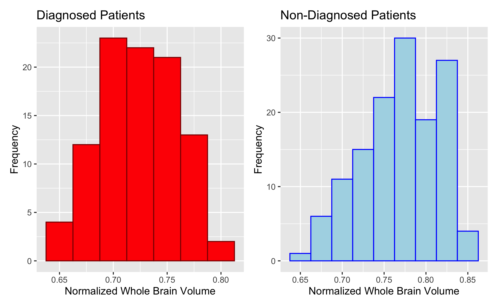
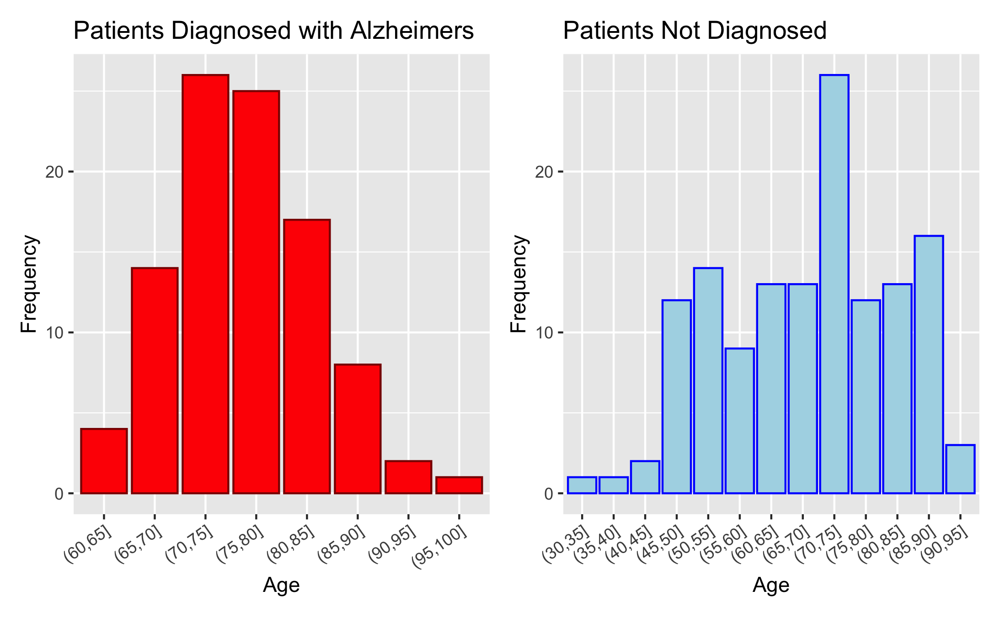

```{r setup, include=FALSE}
# imports 
knitr::opts_chunk$set(
  warning = FALSE,
  message = FALSE,
  echo = FALSE,
  fig.align = "center",
  fig.pos = "H",
  out.width = "85%"
)

library(knitr)
library(openxlsx)
library(dplyr)
library(ggplot2)
library(patchwork)
library(corrplot)
library(cmdstanr)
library(posterior)
library(bayesplot)
library(loo)
library(gridExtra)
library(png)
library(grid)
```

# Problem Formulation:
Alzheimer's disease is a progressive neurodegenerative disorder and the most common cause of dementia, characterized by declining memory and cognition. Early detection through biomarkers and MRI data is critical, as delayed treatment is associated with worse outcomes. In this project, we investigate clinical risk factors associated with Alzheimer's disease using Bayesian Statistics, aiming to identify which groups of people are at higher risk and support early intervention.

## Our research questions are:

i) **How are brain volume, age and biological sex associated with the probability of receiving a diagnosis of Alzheimer’s disease and the diagnosed CDR (Clinical dementia rating)**
- Is there an effect of sex on Alzheimer's disease probability?
- Do individuals with lower brain volume have higher CDR scores?
- Does higher education levels dampen the effect of brain volume on CDR?


## Basic Biological Context and Important Variables
**CDR (The Clinical Dementia Rating Scale)** is a common tool used to assess cognitive impairment.  CDR score of 0 indicates no dementia, 0.5 indicates questionable dementia, 1 is mild dementia, 2 is moderate, and 3 indicates severe dementia. Any individual with a score > 0 has been diagnosed with probable AD. Hence, CDR is a diagnostic as well as a severity tool. 

**MMSE: (Mini-Mental State Examination score)** This is a brief test of global cognitive function, where lower scores usually mean worse cognition. 

**eTIV (estimated total intracranial volume)** Estimated total volume inside skull, estimated from MRI results. 

**nWBV (normalized whole-brain volume)**  This is the proportion of the intracranial cavity occupied by brain tissue. A lower volume would indicate more brain atrophy. Normalization ensures that differences in nWBV correspond to brain atrophy instead of differences in head size.  We are interested in this variable because brain atrophy is a key characteristic of Alzheimer’s disease progression. 

## Key Modelling Challenges:

The key modelling challenge is that the response variable, CDR, is an ordinal variable, with higher values indicating higher disease severity. An ideal Bayesian model using our dataset has to take into account the structure of the categories. We will begin with naive models treating CDR as a binary random variable or as an unordered categorical variable. Then we would build upon these with a more sophisticated model to include the ordering. This is grounded in the framework of progressively increasing model complexity, as often done in the course. 

In addition, we will assess the posterior predictive probabilities for our model through cross-validation, a tool that we were introduced to in the course. We will apply concepts from the theme of Bayesian calibration in this section. 

# Literature Review

Alzheimer’s disease (AD) is a progressive neurodegenerative disorder characterized by cognitive decline and structural brain atrophy. Neuroimaging studies have consistently shown that reductions in brain volume are strongly associated with both aging and Alzheimer’s disease severity. In particular, whole brain volume is known to decline gradually with age and more rapidly in individuals with Alzheimer’s disease, reflecting disease-related neurodegeneration.

These structural changes are closely linked to clinical measures such as the Clinical Dementia Rating (CDR):

- 0 = no dementia  
- 0.5 = very mild  
- 1 = mild  
- 2 = moderate  
- 3 = severe dementia  

And the Mini-Mental State Examination (MMSE):

- 24–30: normal cognition  
- 19–23: mild cognitive impairment  
- 10–18: moderate cognitive impairment  
- 0–9: severe cognitive impairment  

A widely used dataset for studying these relationships is the Open Access Series of Imaging Studies (OASIS), introduced by Marcus et al. (2007). This dataset combines MRI-derived brain measurements with demographic and clinical variables, making it particularly suitable for statistical modeling of Alzheimer’s disease. Key variables include age, biological sex (M/F), years of education (Educ), and socioeconomic status (SES), as well as brain imaging measures such as estimated total intracranial volume (eTIV) and normalized whole-brain volume (nWBV).

## Education Levels (Educ)

- Level 1: Less than high school graduation  
- Level 2: High school graduate (or equivalent)  
- Level 3: Some college (did not complete a 4-year degree)  
- Level 4: College graduate (Bachelor’s degree)  
- Level 5: Beyond college (graduate or professional degree, e.g., MA, PhD, MD)  

## Socioeconomic Status (SES)

- Level 1: Upper class  
- Level 2: Upper middle class  
- Level 3: Middle class  
- Level 4: Lower middle class  
- Level 5: Lower class  

Among these, nWBV is of particular importance as it provides a normalized measure of brain volume that captures atrophy, while eTIV reflects head size and serves as a scaling factor. Clinical variables such as CDR and MMSE provide complementary measures of disease presence and severity. Socioeconomic status (SES) and education level are also important covariates, as they capture social and cognitive factors that may influence disease risk and progression.

Previous studies using the OASIS dataset and similar neuroimaging data have primarily focused on identifying associations between brain structure and cognitive decline. For example, Fotenos et al. (2005) and Buckner et al. (2004) demonstrated strong relationships between brain atrophy and Alzheimer’s disease severity. In addition, a large body of work has applied machine learning techniques to predict Alzheimer’s disease from MRI data. Methods such as support vector machines (Klöppel et al., 2008) and deep learning models (Suk et al., 2014) achieve high classification accuracy by leveraging imaging features such as brain volume. However, these approaches typically emphasize predictive performance and often provide limited interpretability or uncertainty quantification.

In contrast, Bayesian statistical methods offer a principled framework for modeling uncertainty and incorporating prior knowledge in the analysis of complex biomedical data. Rather than producing point estimates, Bayesian approaches yield full posterior distributions for model parameters, allowing researchers to quantify uncertainty through credible intervals and probabilistic statements. This is particularly valuable in medical contexts, where uncertainty plays a critical role in decision-making.

Bayesian methods have been successfully applied in Alzheimer’s research to model disease progression and cognitive decline. For instance, Fonteijn et al. (2012) introduced a Bayesian event-based model to characterize the progression of Alzheimer’s disease as a sequence of latent events, while Donohue et al. (2014) used Bayesian hierarchical models to analyze longitudinal cognitive data (different datasets). These approaches demonstrate the flexibility of Bayesian modeling in capturing complex relationships and latent structures in neurodegenerative diseases.

Despite these advantages, Bayesian approaches have been relatively underutilized in studies based on the OASIS dataset, where most analyses rely on frequentist regression or machine learning techniques.

## Summary

Existing literature establishes strong links between brain atrophy, demographic factors, and Alzheimer’s disease. However, it largely relies on predictive or frequentist approaches. By adopting a Bayesian perspective, this study contributes to the literature by providing interpretable, uncertainty-aware estimates of how brain structure and clinical variables jointly influence Alzheimer’s disease risk and severity.

## Exploratory Data Analysis

First, we must explore the dataset's feature distributions before designing and fitting models.

```{r}
include_graphics("plots/cdr_frequency.png")
```
Most patients are not diagnosed with Alzheimers, and of the diagnosed patients, most of them have been diagnosed  with only mild dementia.


```{r}

```
From the plot above, it appears diagnosed patients typically have less whole brain volume than non-diagnosed patients.

```{r}
diag_vs_sex <- read.csv("data/diag_vs_sex.csv")
kable(diag_vs_sex, caption = "Diagnosis vs Sex")
```
There are more females in the dataset, males have a higher diagnosis rate than females.

```{r}

```
As we can see from the plot, diagnosed patients tend to be older, where non diagnosed patients represent all ages.

# Models

\subsection*{Naive Bayesian Logistic Regression Model}

\paragraph{Priors}
\begin{align*}
\beta_j &\sim \mathcal{N}(0, 3), \quad \text{for } j \in \{0,1,2,3,4,43\}.
\end{align*}

\paragraph{Linear Predictor}
\begin{align*}
\eta_i &= 
\beta_0 
+ \beta_1 \cdot \text{sex}_{i,\text{male}} 
+ \beta_2 \cdot \text{age}_i 
+ \beta_3 \cdot \text{brain\_vol}_i 
+ \beta_4 \cdot \text{educ}_i \\ 
&\quad + \beta_{34} \cdot (\text{brain\_vol}_i \times \text{educ}_i).
\end{align*}

\paragraph{Link Function}
\begin{align*}
\theta_i &= logistic(\eta_i)
\end{align*}

\paragraph{Likelihood}
\begin{align*}
\text{CDR\_binary}_i \mid \theta_i \sim \text{Bernoulli}(\theta_i).
\end{align*}

\subsection*{Complex Model}

Note that we have set $\beta_0 = 1$ for identifiability

\paragraph{Priors}

\begin{align*}
\beta_j &\sim \mathcal{N}(0,2) \quad (j = 1, 2, 3 ,34) \\ 
\delta &\sim \text{Exp}\left(0.3\right) \\ 
k_0 &\sim \mathcal{N}(0,1), \quad k_1 = k_0 + \delta \\ 
\sigma &\sim \text{Exponential}(0.3)
\end{align*}


\paragraph{Likelihood}

\paragraph{Hidden Disease Severity Score}
\begin{align*}
\mu(i) &= \beta_0 
+ \beta_1 \, \text{sex\_male}_i 
+ \beta_2 \, \text{age}_i 
+ \beta_3 \, \text{brain\_vol}_i 
+ \beta_4 \, \text{educ}_i \\ 
&\quad + \beta_{3,4} \, (\text{brain\_vol}_i \times \text{educ}_i)
\end{align*}


\begin{align*}
Z_i \mid \mu(i) &\sim \mathcal{N}(\mu(i), \sigma)
\end{align*}

\paragraph{Disease Outcome}
\[
Y_i \mid Z_i =
\begin{cases}
0 & \text{if } Z_i \le k_0 \\ 
0.5 & \text{if } k_0 \le Z_i \le k_1 \\ 
1 & \text{if } Z_i > k_1
\end{cases}
\]


# Implementation of the Naive Model

After fitting the model, we inspect the quality of the fit.
```{r}
fit_sum <- read.csv("results/naive_model/fit_summary.csv")
kable(head(fit_sum))
```
`rhat` $\approx 1$ for all parameters, indicating that the chains have all converged to the same distribution.  The bulk and tail ESS are high, indicating efficient sampling.  

```{r}
include_graphics("plots/naive_model/calibration.png")
```
As we can see, the model is only decently calibrated.

```{r}
include_graphics("plots/naive_model/rank_hist.png")
```
All of the histograms look roughly flat for all 4 chains for the parameters displayed.  This is an indication of good mixing.

```{r}
include_graphics("plots/naive_model/trace_plot.png")
```
All 4 chains have plenty of overlap, and don't appear to be stuck at any point.  This demonstrates good mixing for all of the priors shown. 

```{r}
loo_output <- readRDS("results/naive_model/loo_output.rds")

print(loo_output$loo)

cat("Average probability assigned to true outcome:", round(loo_output$avg_prob, 3))
```
The Pareto k estimates tell us that there are no outliers influencing the model. \newline
The model is assigning 57.3% probability to the correct outcome (correct class of dementia diagnosis) on average for the leave-one-out predictions.  

## Sensitivity Analysis for Naive Model
```{r, echo=FALSE, fig.width=8, fig.height=4.8}
library(gridExtra)
library(png)
library(grid)

pb3 <- rasterGrob(readPNG("plots/naive_model/posterior_beta3.png"))
pb4 <- rasterGrob(readPNG("plots/naive_model/posterior_beta34.png"))
pm  <- rasterGrob(readPNG("plots/naive_model/posterior_medians.png"))

grid.arrange(
  arrangeGrob(pb3, pb4, ncol = 2),
  pm,
  ncol = 1,
  heights = c(1, 1.1)
)
```

# Implementation of the Complex Model
After fitting, we inspect the quality of the fit and calibration of the model.

```{r}
fit_sum <- read.csv("results/complex_model/fit_summary.csv")
kable(head(fit_sum))
```

```{r, fig.width=10, fig.height=3.8}
c0  <- rasterGrob(readPNG("plots/complex_model/calibration_class0.png"))
c05 <- rasterGrob(readPNG("plots/complex_model/calibration_class05.png"))
c1  <- rasterGrob(readPNG("plots/complex_model/calibration_class1.png"))

grid.arrange(c0, c05, c1, ncol = 3)
```

```{r, fig.width=10, fig.height=3.8}
b1r <- rasterGrob(readPNG("plots/complex_model/beta1_rank.png"))
b2r <- rasterGrob(readPNG("plots/complex_model/beta2_rank.png"))
k0r <- rasterGrob(readPNG("plots/complex_model/k0_rank.png"))

grid.arrange(b1r, b2r, k0r, ncol = 3)
```

```{r, fig.width=10, fig.height=3.8}
b1t  <- rasterGrob(readPNG("plots/complex_model/beta1_trace.png"))
b34t <- rasterGrob(readPNG("plots/complex_model/beta34_trace.png"))
k0t  <- rasterGrob(readPNG("plots/complex_model/k0_trace.png"))

grid.arrange(b1t, b34t, k0t, ncol = 3)
```

## Senstivity Analysis on the Complex Model
```{r, echo=FALSE, fig.width=8, fig.height=5}

b3d  <- rasterGrob(readPNG("plots/complex_model/beta3_density_hmc_vi.png"))
b34d <- rasterGrob(readPNG("plots/complex_model/beta34_density_hmc_vi.png"))
cred <- rasterGrob(readPNG("plots/complex_model/cred_interval_hmc_vi.png"))

grid.arrange(
  b3d, b34d,
  cred,
  ncol = 2,
  heights = c(1, 1.2)
)
```


# Contributions of Each Group Member
Each group member contributed roughly equally.  Michael wrote the literature review, performed the sensitivity analysis for both models, and the variational inference for the complex model.  Sachit wrote the problem formulation, primarily designed both models, and implemented the complex model, including the stan implementation, calibration checks, model diagnostics, evaluation of the posterior approximation, and the code correctness for both models.  Sarenna set up the repository/virtual environment, processing the raw data and the exploratory data analysis, and implementing the naive model, including the stan implementation, calibration checks, model diagnostics, evaluation of the posterior approximation, and the leave-one-out for both models.

# Appendix

### Sources:
https://www.alz.org/alzheimers-dementia/what-is-dementia \newline
https://www.who.int/news-room/fact-sheets/detail/dementia \newline


